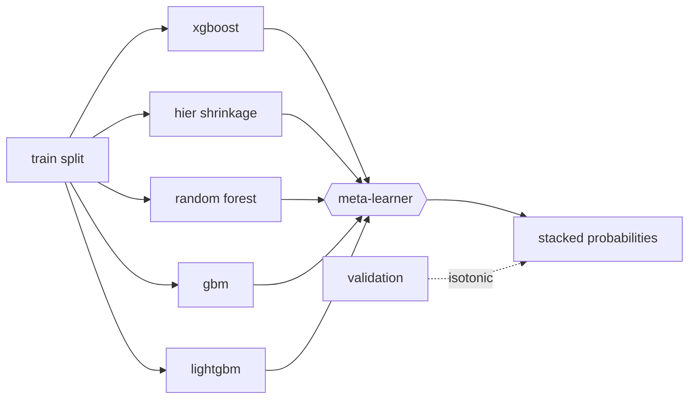
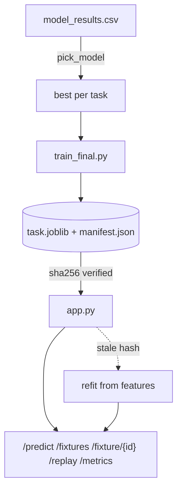

# Touchline Model Book

> [!abstract] What this note is
> The companion to [[feature_book]]. That one documents everything the models **eat**.
> This one documents everything the models **are** — every learner in the zoo, how each
> is tuned, calibrated and scored, which one is actually served, and the one honest
> answer that matters: **can you beat the bookmaker?**

| | |
|---|---|
| **Tasks** | 3 (C, R, L) across 4 model heads |
| **Learners in the zoo** | 6 classifiers · 8 regressors · 2 ensembles |
| **Pre-match train / test** | 39,707 / 5,806 matches |
| **In-play train / test** | 17,024 / 6,536 snapshots (344 matches × 19) |
| **Test span** | 2023/24 – 2024/25, strictly after every training match |
| **Odds coverage on test** | 5,806 / 5,808 = **99.97%** |
| **Served** | C `xgboost` · R `gbm` · Lc `random_forest` · Lr `stack` (best point estimate; not a significant win) |
| **Served latency** | `/predict` p50 **0.32 ms**, p99 0.34 ms |

---

## 1 · The three tasks

Labels are derived **once, from the match file only** — never from odds, never from
events. `build_label_store.py` independently recomputes them from the scores and
asserts equality with `match_store.csv`.

| Task | Question | Label | Metric |
|---|---|---|---|
| **C** | Who wins, before kick-off? | `label_result ∈ {H, D, A}` | RPS ↓ |
| **R** | By how much? | `label_margin = clip(home − away, −5, +5)` | MAE ↓ |
| **L** | Both, live, one snapshot per 5 regulation minutes | same two, at $t \in \{0,5,\dots,90\}$ | RPS ↓ / MAE ↓ |

Task L is served as two heads, `Lc` (outcome) and `Lr` (margin), sharing one feature table.

> [!info] Why RPS and not accuracy
> Football outcomes are **ordered**: H → D → A. Ranked Probability Score charges you for
> distance, so predicting *Away* when the truth is *Home* costs more than predicting *Draw*.
> $$\mathrm{RPS} = \frac{1}{r-1}\sum_{i=1}^{r-1}\left(\sum_{j=1}^{i} p_j - \sum_{j=1}^{i} o_j\right)^2$$
> Accuracy would reward the degenerate "always Home" classifier, which is exactly what the
> `dummy` baseline does — and it scores 0.23008.

---

## 2 · The model zoo

`model_zoo.py` builds every learner from one place. Hyperparameters come from
`best_params.json`, produced by an **equal-budget random search** (`tuning.py`) with the
CV folds living entirely inside the training split.

| Model | C | R | L | Notes |
|---|:-:|:-:|:-:|---|
| `dummy` | ✅ | ✅ | ✅ | prior / mean. The floor everything must clear |
| `random_forest` | ✅ | ✅ | ✅ | |
| `gbm` | ✅ | ✅ | ✅ | `HistGradientBoosting*` |
| `xgboost` | ✅ | ✅ | ✅ | wrapped in `LabelEncodedClassifier` |
| `lightgbm` | ✅ | ✅ | ✅ | |
| `p2_hier_shrinkage` | ✅ | ✅ | ✅ | **paper reimplementation** — hierarchical shrinkage |
| `kernel_svm` | ✅ | — | — | RBF SVC |
| `kernel_svr` | — | ✅ | — | |
| `kernel_ridge_exact` | — | ✅ | — | subsampled to 8,000 rows — see §7 |
| `kernel_ridge_nystroem` | — | ✅ | — | the scalable counterpart |
| `stack` | ✅ | ✅ | ✅ | **new** — out-of-fold meta-learner |
| `stack_temporal` | ✅ | ✅ | ✅ | **new** — validation-fitted meta-learner |

> [!warning] Silent zoo shrinkage
> `model_zoo.py` guards the `xgboost` and `lightgbm` imports in `try/except`. Without
> `libomp` they vanish **with no warning** and the classifier zoo quietly returns 4 of 6.
> `brew install libomp` if a sweep comes back short.

### Calibration

Every classifier is fitted on train, then wrapped in `CalibratedClassifierCV` over a
`FrozenEstimator` and calibrated on **validation**, isotonic first, sigmoid as fallback.
Test is never touched. Probabilities are floored at 0.005 and renormalised so a confident
model cannot take an unbounded log-loss hit on one surprise.

---

## 3 · Results — held-out test

### Task C · pre-match outcome

| Model | RPS ↓ | Log loss | Brier | ECE after |
|---|---|---|---|---|
| **MARKET (de-vigged)** | **0.18945** | 0.95433 | 0.56590 | 0.01817 |
| `xgboost` | 0.19451 | 0.97159 | 0.57713 | 0.01960 |
| `p2_hier_shrinkage` | 0.19461 | 0.97071 | 0.57711 | 0.02175 |
| `random_forest` | 0.19481 | 0.97195 | 0.57755 | 0.01303 |
| `gbm` | 0.19491 | 0.97346 | 0.57817 | 0.01795 |
| `lightgbm` | 0.19573 | 0.97714 | 0.58040 | 0.02745 |
| `kernel_svm` | 0.20054 | 0.99381 | 0.59179 | 0.02805 |
| `dummy` | 0.23008 | 1.07544 | 0.65087 | 0.01131 |

> [!danger] The headline result: **the market wins**
> The best pure model trails the de-vigged Bet365 line by **+0.00499 RPS** (≈2.6% relative).
> Every model clears the dummy by a wide margin and they cluster inside 0.001 of each other —
> which says the signal is real but *shared*, and the bookmaker has some of it that we don't.
> This is reported, not buried. See §5 for how far a blend closes it.

### Task R · pre-match margin

| Model | MAE ↓ | RMSE | corr |
|---|---|---|---|
| `gbm` | **1.25035** | 1.60544 | 0.48675 |
| `xgboost` | 1.25035 | 1.60612 | 0.48596 |
| `lightgbm` | 1.25087 | 1.60555 | 0.48606 |
| `random_forest` | 1.25270 | 1.60837 | 0.48362 |
| `p2_hier_shrinkage` | 1.25284 | 1.60737 | 0.48418 |
| `kernel_ridge_nystroem` | 1.26106 | 1.62194 | 0.47234 |
| `kernel_svr` | 1.26287 | 1.62876 | 0.47060 |
| `kernel_ridge_exact` | 1.26941 | 1.63601 | 0.46147 |
| `dummy` | 1.43711 | 1.83806 | 0.0 |

### Task L · in-play

| Model | Lc RPS ↓ | Lr MAE ↓ |
|---|---|---|
| `stack` | 0.14688 | **0.95633** |
| `random_forest` | **0.14559** | 0.96015 |
| `xgboost` | 0.14793 | 0.98435 |
| `p2_hier_shrinkage` | 0.14841 | 0.97757 |
| `gbm` | 0.15545 | 0.98820 |
| `lightgbm` | 0.15566 | 0.99445 |
| `stack_temporal` | 0.14945 | 0.96655 |
| `dummy` | 0.22812 | 1.48997 |

`Lr` is the one head where the ensemble wins **on the point estimate** — but the difference is
not statistically resolvable. See §4.

---

## 4 · The stacked ensemble

New in v2. A meta-learner over the tuned zoo — multinomial logit for C/Lc, `RidgeCV` for
R/Lr — described fully in [[CLAUDE#Stacked ensemble]].



> [!important] It is deliberately **not** a zoo member
> A zoo factory has no way to receive the grouped folds the in-play tasks need. So every
> `classifier_zoo()` / `regressor_zoo()` loop stays stack-free, and the stack is built only
> through `stacking.build_named_stack(...)`. Four call sites use it: `train_ensemble.py`,
> `train_final.py`, `train_market_blend.py`, `service/app.py`.

**Members**: 5 per task (4 for Lr). `kernel_svm` is excluded — 940 s of fit time for the
worst RPS in the zoo, refitting it five more times buys nothing. `p2_hier_shrinkage` is
excluded from Lr only (260 s).

### Two variants, and why the second exists

| Variant | Meta-learner fitted on |
|---|---|
| `stack` | 5-fold **out-of-fold** predictions over the training split |
| `stack_temporal` | the earliest **60% of validation matches** |

The textbook variant learns its combination weights from random folds of **2008–2021**.
The test split is **2023–25**. Those weights transfer only as well as the era does — and
measurably, they don't. `stack_temporal` fits the meta-learner on the most recent data that
is still not test, which is the same reasoning behind the market blend's validation-chosen
$\alpha$.

### Results

| Task | `stack` (OOF) | `stack_temporal` | Best single | Δ best stack vs single | **Served** |
|---|---|---|---|---|---|
| **C** · RPS ↓ | 0.19524 | **0.19463** | `xgboost` **0.19451** | +0.00012 | `xgboost` |
| **Lc** · RPS ↓ | **0.14688** | 0.14945 | `random_forest` **0.14559** | +0.00129 | `random_forest` |
| **R** · MAE ↓ | 1.25139 | **1.25123** | `gbm` **1.25035** | +0.00088 | `gbm` |
| **Lr** · MAE ↓ | **0.95633** | 0.96655 | `random_forest` 0.96015 | **−0.00382** | **`stack`** ✅ |

> [!info] The variant split is the real finding — and the pattern says why
> **`stack_temporal` beats `stack` on the pre-match tasks (C, R); `stack` beats
> `stack_temporal` on the in-play tasks (Lc, Lr).** That is not noise, it is the era gap:
>
> - **C and R** train on 2008–2021 and test on 2023–25. Combination weights learned from
>   random folds of the deep past transfer badly, so moving the meta-learner onto recent
>   validation data recovers most of the loss — 0.19524 → 0.19463 on C, which is 84% of the
>   way back to the best single model.
> - **Lc and Lr** live entirely inside StatsBomb 2015/16. Train, validation and test are all
>   the same season, so there is **no drift to correct** — and `stack_temporal` just pays for
>   a smaller meta-training set with extra variance. It loses.
>
> On the point estimate, Lr is the only head the ensemble wins: MAE 0.95633 vs 0.96015, −0.40%.
> **That win does not survive a significance test** — see below.

> [!failure] None of these differences are statistically resolvable
> A paired **cluster** bootstrap (resampling whole matches, because the 6,536 in-play rows are
> 19 snapshots of only 344 matches) puts every ensemble-vs-single comparison flat on zero:
>
> | Task | a vs b | mean Δ | 95% CI | p | reading |
> |---|---|---|---|---|---|
> | C | `stack_temporal` − `xgboost` | +0.00013 | [−0.00028, +0.00053] | 0.54 | indistinguishable |
> | Lc | `stack` − `random_forest` | +0.00129 | [−0.00138, +0.00392] | 0.36 | indistinguishable |
> | R | `stack_temporal` − `gbm` | +0.00088 | [−0.00126, +0.00292] | 0.41 | indistinguishable |
> | Lr | `stack` − `random_forest` | **−0.00382** | **[−0.01150, +0.00384]** | **0.33** | **indistinguishable** |
>
> The Lr "win" is better on only **52.0%** of matches. Task C is the well-powered case — 5,808
> independent matches — and it is still flat.
>
> **Conclusion: stacking five tuned learners changes nothing measurable on this data.** Six
> models sitting inside 0.001 RPS of each other are not disagreeing in useful ways; they are
> reading the same signal out of the same features. Ensembling cannot manufacture information
> that is not in the feature set, and the gap to the market (§5) is a **data** problem, not a
> model-class problem.
>
> Reproduce: [[model_vs_market]] §9 and §11.

### Fold discipline

> [!check] Two rules the tests enforce
> - `training_groups()` returns `match_id` for Lc/Lr and `None` for C/R (one pre-match row
>   *is* one match). When groups exist, `_splits` uses `GroupKFold` — otherwise minute 15 of
>   a match would train the meta-learner that scores minute 60 of the same match.
> - `temporal_meta_holdout()` cuts on **match boundaries, never on rows**.
>
> `test_stacking.py` — 14 tests, run by path — guards both.

`train_ensemble.py` scores the stack through the **same** `evaluate_classification` /
`evaluate_regression` as every other model and upserts its rows into `model_results.csv`,
so the numbers on this page are directly comparable.

---

## 5 · The market, and the blend

### The baseline

`build_market_baseline.py` de-vigs Bet365 1X2 odds to probabilities summing to 1. The join
to StatsBomb uses **pre-match identity only** — accent stripping, token similarity,
Levenshtein, plus one documented override (`"Ath Madrid"` → Atlético, since no string metric
separates Athletic from Atlético). Score and statistic fields are never allowed into that join.

| League | Test matches | Tagged | Coverage |
|---|---|---|---|
| Bundesliga, Eredivisie, La Liga, Ligue 1, Premier League, Primeira Liga, Scottish Prem, Serie A | 5,184 | 5,184 | 1.0000 |
| Pro League | 624 | 622 | 0.9968 |
| **ALL** | **5,808** | **5,806** | **0.9997** |

### The blend arm

$$p_{\text{blend}} = \alpha \cdot p_{\text{market}} + (1-\alpha)\, p_{\text{model}}$$

with $\alpha$ chosen on validation. In-play it decays, because the market prior is worth
most before kick-off and least at minute 90:

$$\alpha(t) = \alpha_0 \, e^{-t/\tau}$$

| Task | Arm | $\alpha$ | $\tau$ | RPS ↓ |
|---|---|---|---|---|
| C | model only | — | — | 0.19444 |
| C | **market only** | — | — | **0.18945** |
| C | blend | 0.66 | — | 0.19035 |
| Lc | model only | — | — | 0.14572 |
| Lc | **blend** | 0.34 | 30 min | **0.14235** |

**Read this honestly.** On task C the blend closes ~82% of the gap to the market but does
not cross it. On the in-play task the blend genuinely wins — the model knows the live state,
the market knows the priors, and neither alone is best.

> [!warning] This is a **declared** experiment
> Odds are used **either** as the market baseline **or** as a feature — never both in one
> experiment. The blend is the one place odds are a feature. It is reported *beside* the
> model in the API, never folded into `probabilities`, and never into the model-vs-market
> `edge` / `value_pick` — those stay odds-free so the market remains a clean yardstick.

---

## 6 · In-play — how information accrues

`Lc` RPS by snapshot minute, `random_forest`, against the **frozen pre-match reference** —
the same pre-match forecast held flat across all 90 minutes, on the same 344 matches, so the
two series are genuinely comparable:

| min | 0 | 15 | 30 | 45 | 60 | 75 | 90 |
|---|---|---|---|---|---|---|---|
| **in-play** | 0.2151 | 0.2058 | 0.1987 | 0.1594 | 0.1226 | 0.0847 | 0.0260 |
| frozen pre-match | 0.2213 | 0.2213 | 0.2213 | 0.2213 | 0.2213 | 0.2213 | 0.2213 |

The curve is the project in one line. The in-play model is ahead of the frozen reference from
the very first snapshot — at $t=0$ it already has the strength priors *plus* the lineup — and
the gap then widens as events accumulate, until by full time it is essentially reading the
scoreboard. The interesting region is **minutes 30–70**, where events have started to matter
but the result is not yet decided; that is where a live model earns its keep.

> [!caution] Don't compare this to §3
> The 0.19451 in the Task C table is on **5,806 extended-era matches**. The numbers here are on
> **344 StatsBomb 2015/16 matches**. Different test sets — the only fair pre-match comparator on
> this page is the frozen reference row above, and that reference is itself the older
> `n_train = 896` model (see §10).

> [!note] Event ordering trap
> `REPORT.md` says events are ordered by `(period, timestamp, index)`. True in
> `clean_store.py:52` — but downstream in-play feature code deliberately sorts by
> `(period, index)` and **drops the timestamp**, because ~26 events carry corrupted
> `00:00:00` timestamps that would otherwise sort to the front of their period.

---

## 7 · Kernel scaling — the O(n²) demonstration

`kernel_ridge_exact` is kept in the zoo *because* it fails to scale, and that failure is a
graded deliverable.

| n_train | fit (s) | peak MB | theoretical Gram MB |
|---|---|---|---|
| 500 | 0.004 | 0.8 | 1.9 |
| 2,000 | 0.051 | 61 | 30.5 |
| 8,000 | 1.339 | 978 | 488 |
| 12,000 | 3.776 | 2,335 | 1,099 |
| 17,024 | 11.356 | — | 2,211 |

Empirical time exponent **2.275** against a theoretical 3.0 for the solve — BLAS threading
and cache effects flatter the constant, but the memory wall is unambiguous. On the full
39,707-row pre-match table the Gram matrix alone would be ~12 GB, which is why the exact
kernel is capped at 8,000 rows (`subsampled = True` in `model_results.csv`) and
`kernel_ridge_nystroem` exists as the scalable stand-in — and beats it (1.26106 vs 1.26941).

---

## 8 · Leakage discipline

> [!check] Graded requirements, not style preferences
> - Pre-match features use only matches that **finished before kick-off** — `.shift(1)`
>   before `.rolling(...)`, in that order.
> - In-play features use only events at or before $t$; the builder asserts the slice is a
>   clean prefix.
> - All snapshots of one match stay on **one side** of every split boundary — including
>   inside the ensemble's cross-validation folds.
> - Imputers, scalers and any resampling are fitted on **training rows only**; calibration
>   on validation; test touched once.
> - Splits are by **season boundary**: train ≤ 2020/21, val 21/22–22/23, test 23/24–24/25.
>   The StatsBomb in-play val/test ids are marked `"excluded"` from C/R so the replay
>   demo's pre-match panels stay honest.

---

## 9 · What gets served

`train_final.py` persists a joblib bundle per task to `src/reports/models/{task}.joblib`
plus a `manifest.json` carrying the **sha256 of every input file**. On startup `app.py`
verifies those hashes and silently refits if anything has drifted, so a stale artifact can
never be served against changed features.



| Endpoint | Returns |
|---|---|
| `/predict?match_id=&minute=` | pre-match (`minute<0`) or snapshot payload |
| `/fixtures` | cards: model probs, odds, **edge vs market**, value flag, blend |
| `/fixture/{id}` | + form, Elo/pi ratings, XI rating cards |
| `/replay/{id}` | pre-match + all 19 snapshots in one batched pass |
| `/metrics` | served models, market gap, blend weights, ensemble comparison, `shap_source` |

**Latency** — everything expensive happens at startup; the first request for a match builds
all its payloads in one batched pass and caches them.

| Endpoint | p50 | p95 | p99 |
|---|---|---|---|
| `/health` | 0.248 ms | 0.261 | 0.298 |
| `/predict` | 0.316 ms | 0.330 | 0.339 |
| `/predict?pre` | 0.325 ms | 0.428 | 0.516 |
| `/replay` | 1.166 ms | 1.260 | 1.651 |

> [!tip] Why batching matters more than it looks
> A scikit-learn ensemble's `predict` cost is dominated by **fixed per-call overhead**, not
> row count — one call for 19 rows costs barely more than one call for 1 row. Serving a
> replay a row at a time paid that overhead 19 times over, twice.

### Explaining a stacked model

TreeSHAP needs a tree ensemble, and a stack is not one. A served stack is explained through
`stack.tree_base()` — its **strongest tree member** — and the payload reports which, as
`shap_source`. `tree_base` returns that member's *own* class order, which is not the
wrapper's: a label-encoded member (`xgboost`) reports integer classes, and reusing the
wrapper's order there would silently attribute the wrong class.

---

## 10 · Known-stale analyses

> [!bug] These predate the extended data layer — do not quote them for the current models
> `ablation.csv`, `resampling_study.csv`, `significance_bootstrap.csv`, `p1_comparison.csv`,
> `margin_to_probability.csv`, `shap_importance.csv` were all written **2026-08-24**, before
> the 2008–2025 extended store landed on 08-28. They report `n_train = 896`, `n_test = 344` —
> the old 2015/16-only pre-match table. The **in-play** analyses at `n = 344` matches are
> current, since the in-play tasks never moved off the StatsBomb store.
>
> What they still tell you, qualitatively:
> - **Ablation**: dropping `expected_goals` hurts most (0.1993 → 0.2017); dropping `h2h`
>   *helps* (0.1993 → 0.1977) — head-to-head is noise at 3 prior meetings.
> - **Resampling / P1 (G-SMOTENC)**: helps draw recall enormously (0.064 → 0.487 for
>   `random_forest`) and hurts RPS for **every** model. Oversampling buys the minority class
>   at the cost of calibration.
> - **Significance**: on 344 matches, Holm-corrected bootstrap finds **no detectable
>   difference** between any pair of models. On 5,806 test matches this needs redoing — it is
>   the single most valuable rerun on the list.

---

## 11 · Reproduce

```bash
source /Users/parsabordbar/venev/ml/bin/activate

# everything
python src/pipeline/run_all.py
SKIP_TUNING=1 python src/pipeline/run_all.py   # reuse best_params.json

# just the model layer
python src/models/tuning.py
python src/models/run_models.py                # the sweep
python src/models/test_stacking.py             # 14 tests
python src/models/train_ensemble.py            # both stack variants
python src/models/train_final.py               # persist serving bundles
python src/models/train_market_blend.py        # declared odds-as-feature arm
python src/models/market_comparison.py         # vs de-vigged odds

# serve
python src/service/app.py                      # 127.0.0.1:5500 (PORT env)
```

There is **no pytest config** — run tests directly by path.

---

## See also

- [[feature_book]] — every dataset and every engineered column
- [[final_defence_script]] — the spoken version
- `CLAUDE.md` §Stacked ensemble, §Serving the blend arm
- `REPORT.md` — formal problem definitions (stops at §3)
